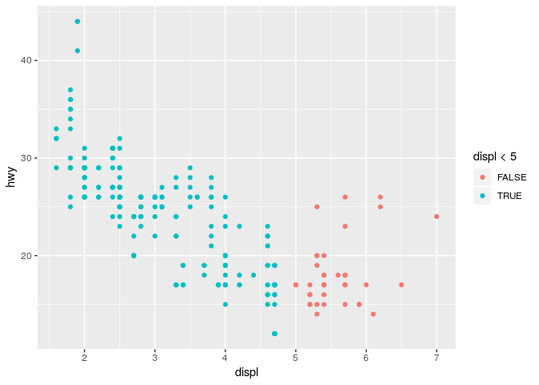

Homework 1: ggplot2
================
Your Name
2019-03-04

``` r
library(ggplot2)
```

By using *mpg* dataset:

1.  Map a continuous variable to color, size, and shape. How do these
    aesthetics behave differently for categorical vs. continuous
    variables?

<!-- end list -->

  - Color

<!-- end list -->

``` r
ggplot(data = mpg) + geom_point(mapping = aes(x = displ, y = hwy, color = cty))
```

<!-- -->

  - Size

<!-- end list -->

``` r
ggplot(data = mpg) + geom_point(mapping = aes(x = displ, y = hwy, size = cty))
```

<!-- -->

  - Shape

<!-- end list -->

``` r
ggplot(data = mpg) + geom_point(mapping = aes(x = displ, y = hwy, shape= class))
```

    ## Warning: The shape palette can deal with a maximum of 6 discrete values
    ## because more than 6 becomes difficult to discriminate; you have 7.
    ## Consider specifying shapes manually if you must have them.

    ## Warning: Removed 62 rows containing missing values (geom_point).

<!-- -->

2.  What happens if you map the same variable to multiple
aesthetics?

<!-- end list -->

``` r
ggplot(data = mpg) + geom_point(mapping = aes(x = displ, y = hwy, color = cty, size = cty))
```

<!-- -->

3.  What does the stroke aesthetic do? What shapes does it work with?
    (Hint: use
?geom\_point)

<!-- end list -->

``` r
ggplot(data = mpg) + geom_point(mapping = aes(x = displ, y = hwy, stroke= cyl, shape = class))
```

    ## Warning: The shape palette can deal with a maximum of 6 discrete values
    ## because more than 6 becomes difficult to discriminate; you have 7.
    ## Consider specifying shapes manually if you must have them.

    ## Warning: Removed 62 rows containing missing values (geom_point).

<!-- -->

4.  What happens if you map an aesthetic to something other than a
    variable name, like aes(colour = displ \<
5)?

<!-- end list -->

``` r
ggplot(data = mpg) + geom_point(mapping = aes(x = displ, y = hwy, colour = displ < 5))
```

<!-- -->
